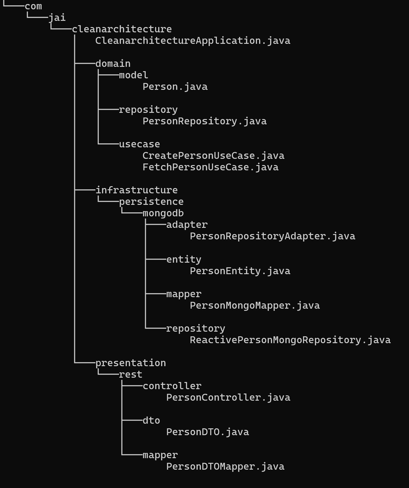

# Spring Boot Clean Architecture WebFlux API

This repository contains a clean architecture implementation of a web API using Spring Boot and WebFlux. Clean architecture is a software design pattern that promotes separation of concerns and maintainability by organizing code into distinct layers with clear dependencies and responsibilities. This project aims to provide a well-structured foundation for building scalable and maintainable web applications.

## Table of Contents

- [Getting Started](#getting-started)
    - [Prerequisites](#prerequisites)
    - [Installation](#installation)
- [Project Structure](#project-structure)
- [Usage](#usage)
- [Features](#features)
- [Technologies Used](#technologies-used)
- [Contributing](#contributing)
- [License](#license)

## Getting Started

Follow these instructions to get the project up and running on your local machine.

### Prerequisites

- [Java](https://www.oracle.com/java/technologies/javase-downloads.html) (Java 17 or higher)
- [Maven](https://maven.apache.org/download.cgi)
- [Docker](https://docs.docker.com/get-docker/)

### Installation

1. Clone the repository:

   ```bash
   git clone https://github.com/jugurta/cleanarchitecture.git
   ```

2. Navigate to the project directory:

   ```bash
   cd cleanarchitecture
   ```

3. Build the project using Maven:

   ```bash
   mvn clean install
   ```

The application should now be up and running locally.

## Project Structure

The project follows the clean architecture principles, which means it's organized into distinct layers:

- **Presentation**: Contains the web controllers and request/response models.
- **Domain**: Contains the core domain entities and business rules.
- **Infrastructure**: Handles database access and data storage.

This separation of concerns makes the application easy to maintain and test.



## Usage

To interact with the API, you can use tools like [Postman](https://www.postman.com/) or [curl](https://curl.se/).

Example API endpoints:


- `POST /person`: Create a new person.
- `GET /person/{id}`: Retrieve a person by ID.

Ensure to check the API documentation and the available endpoints in the project source code.

## Features

- Clean architecture for maintainability and scalability.
- Reactive programming with Spring WebFlux.
- Dockerized application for easy deployment.
- API endpoints for user management.

## Technologies Used

- [Spring Boot](https://spring.io/projects/spring-boot)
- [Spring WebFlux](https://docs.spring.io/spring-framework/docs/current/reference/html/web-reactive.html)
- [Maven](https://maven.apache.org/)
- [Docker](https://www.docker.com/)

## Contributing

Contributions are welcome! If you'd like to contribute to this project, please follow these steps:

1. Fork the repository.
2. Create a new branch for your feature or bug fix.
3. Make your changes and commit them.
4. Push your changes to your fork.
5. Create a pull request to the `main` branch of this repository.

Please ensure your code follows the project's coding standards and includes appropriate tests.

## License

This project is licensed under the MIT License - see the [LICENSE](LICENSE) file for details.

---

Happy coding! 🚀